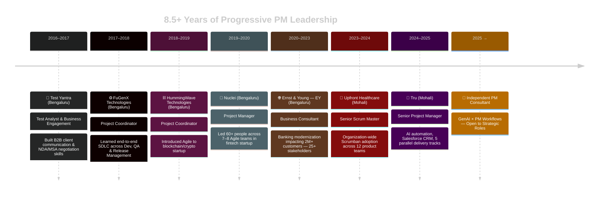

<div align="center">


<br/>

[](https://git.io/typing-svg)

<br/>

[](https://linkedin.com/in/theyone/)
[](mailto:devisthesolution@gmail.com)
[](https://github.com/devenkashyap)
[](#)
[](https://github.com/devenkashyap)

</div>

---

## 🧬 Who Is Deven Kashyap?

```yaml
identity:
  name        : "Deven Kashyap"
  title       : "Senior Project Manager | Senior Scrum Master"
  experience  : "8.5+ years"
  location    : "Mohali, Punjab, India (IST — UTC+5:30)"
  languages   : ["English", "Hindi", "Punjabi", "Kannada"]

expertise:
  - "Business Transformation & Agile Coaching"
  - "PMO Architecture & Governance Frameworks"
  - "Multi-domain Delivery (Banking, Healthcare, SaaS, Retail)"
  - "AI/Automation Integration in PM Workflows"
  - "Organizational Dysfunction Diagnosis & Turnaround"

currently_building:
  - "n8n workflow automations for sprint reporting"
  - "GenAI-powered PM governance dashboards"
  - "Prompt engineering pipelines for delivery intelligence"

open_to:
  - "Senior PM / Program Director Roles"
  - "Agile Coaching & Transformation Leadership"
  - "AI-augmented Delivery Consulting"
  - "Roles with ownership, realistic scope, and autonomy"

philosophy: >
  "Master the PM craft, adapt tech fluently, solve real problems.
   Diagnose the dysfunction. Design the solution. Sustain the change."
```

---

## 🚀 Career Timeline



---

## 📊 Impact at a Glance

<div align="center">

| 🎯 Metric | 💥 Impact |
|---|---|
| 👥 **People Led** | **60+ people** across **7–8 Agile teams** simultaneously |
| 🏢 **Stakeholders Managed** | **25+ stakeholders** across 6 workstreams (EY Banking) |
| 🏥 **Agile Transformation Scale** | **12 product teams** transformed at Upfront Healthcare |
| 📦 **Parallel Delivery** | **5 concurrent initiatives** (web, mobile, e-commerce) at Tru |
| 👤 **Salesforce CRM Team** | **18-member cross-functional team** delivered on time |
| ⏱️ **Escalation Resolution** | Reduced resolution time from **10 days → 3 days** |
| ⚡ **Automation Win** | Freed **15+ team members** from manual status updates (n8n) |
| 🌍 **Customer Impact** | Banking modernization serving **2M+ customers** |
| 🏅 **Recognition** | Exceptional Quality Delivery · EY Innovation Bronze |

</div>

---

## 💼 Professional Experience

<details>
<summary><b>🚀 Tru — Senior Project Manager (2024–2025 · Mohali)</b></summary>

<br/>

**Diagnosed the bottleneck:** Teams spent 3+ hours daily on manual status pings — slowing sprint execution and blocking delivery focus.

| What I Did | Outcome |
|---|---|
| Built n8n workflow auto-generating daily Jira sprint summaries | Freed **15+ team members** from manual update cycles |
| Created Power BI dashboards for real-time sprint visibility | Leadership achieved **self-serve** status — zero manual requests |
| Managed 18-member cross-functional Salesforce CRM delivery | **On-time delivery** + high user adoption |
| Coordinated 5 parallel tracks (web, mobile, e-commerce) | **3 major products** shipped on schedule |

</details>

<details>
<summary><b>🏥 Upfront Healthcare — Senior Scrum Master (2023–2024 · Mohali)</b></summary>

<br/>

**Led organization-wide Agile transformation** across 12 product teams with Scrumban adoption (time-boxed planning, WIP limits, reviews, retrospectives).

| What I Did | Outcome |
|---|---|
| Diagnosed team dysfunction → implemented Scrumban | Teams hit **delivery predictability within 3 sprints** |
| Root-cause analysis of escalation delays | Resolution time reduced from **10 → 3 days** |
| Authored Azure DevOps standardization playbook | Organization-wide Scrumban practices **documented & scaled** |
| Mentored 3 new Scrum Masters | Built **sustainable capability** independent of my involvement |
| Established cross-team sync, portfolio reviews & exec forums | Governance model: **team autonomy + organizational oversight** |

</details>

<details>
<summary><b>🌐 Ernst & Young (EY) — Business Consultant (2020–2023 · Bengaluru)</b></summary>

<br/>

**Led large-scale banking modernization** impacting 2M+ customers across 6 workstreams with 25+ stakeholders.

| What I Did | Outcome |
|---|---|
| Designed transformation roadmap across 6 workstreams | Program delivered **on schedule** with structured governance |
| Established steering committee cadence (weekly tactical / monthly strategic) | RACI, escalation paths, decision protocols embedded across org |
| Designed PMO operating model (intake, stage-gate, health checks, PIR) | Organization reached measurable **project delivery maturity** |
| Built Power BI dashboards + KPI tracking | Leadership decision-making with **zero manual status requests** |
| Coached teams on hybrid delivery (governance + Agile) | **Improved sprint predictability** in banking PMO context |

</details>

<details>
<summary><b>🏦 Nuclei — Project Manager (2019–2020 · Bengaluru)</b></summary>

<br/>

**Diagnosed dysfunction across 7 teams (60+ people)** in a high-velocity fintech/banking startup — designed and implemented Scrumban governance from the ground up.

- Instituted sprint planning cadence, daily standups, retrospectives, WIP limits, and flow metrics
- Built weekly dependency tracking + cross-team communication → reduced blocking issues
- Managed vendor ecosystem: 3 third-party integrations, SLA compliance, delivery timelines
- Orchestrated parallel mobile and web product launches — quality maintained under aggressive deadlines

</details>

<details>
<summary><b>⛓️ HummingWave Technologies — Project Coordinator (2018–2019 · Bengaluru)</b></summary>

<br/>

- Introduced Agile practices to blockchain/crypto startup; established sprint planning and backlog grooming
- Managed crypto wallet client relationships; tracked requirements, ensured on-time delivery
- Built domain expertise in blockchain technology, crypto workflows, fintech landscape

</details>

<details>
<summary><b>⚙️ FuGenX Technologies — Project Coordinator (2017–2018 · Bengaluru)</b></summary>

<br/>

- Learned end-to-end SDLC across development, QA, release management, and vendor coordination
- Delivered under organizational pressure — managed client and vendor-side delays; built resilience and pragmatic problem-solving skills

</details>

<details>
<summary><b>🔬 Test Yantra — Test Analyst & Business Engagement (2016–2017 · Bengaluru)</b></summary>

<br/>

- Built B2B client communication skills with global foreign clients; overcame cultural barriers and confidence gaps
- Developed sales and negotiation acumen: NDA/MSA negotiation, client psychology, difficult conversations

</details>

---

## 🛠️ Tools, Tech & Methodologies

### 🗂️ Project Management & Collaboration


### 📊 Analytics & Reporting


### 🤖 AI, Automation & GenAI


### 🔄 Methodologies & Frameworks


---

## 🧠 Core Competencies

<div align="center">

```
┌─────────────────────────────────────────────────────────────────────┐
│                     DEVEN'S CAPABILITY MAP                          │
├─────────────────────────┬───────────────────────────────────────────┤
│  🔍 DIAGNOSE            │  Root-cause analysis, AS-IS/TO-BE mapping │
│                         │  Organizational dysfunction diagnosis      │
│                         │  Stakeholder analysis & readiness          │
├─────────────────────────┼───────────────────────────────────────────┤
│  🎯 DESIGN              │  PMO operating models & governance         │
│                         │  Escalation paths, RACI, decision forums   │
│                         │  Phase-gate methodology across lifecycle    │
├─────────────────────────┼───────────────────────────────────────────┤
│  🚀 DELIVER             │  Multi-team coordination (60+ people)      │
│                         │  Parallel initiative management (5+)        │
│                         │  Vendor ecosystem & SLA management          │
├─────────────────────────┼───────────────────────────────────────────┤
│  🔄 TRANSFORM           │  Agile coaching & Scrumban adoption         │
│                         │  Org-wide change management                 │
│                         │  Resistance navigation & capability building│
├─────────────────────────┼───────────────────────────────────────────┤
│  🤖 AUTOMATE            │  n8n workflow design & GPT-4 integration    │
│                         │  AI-powered dashboards & status automation  │
│                         │  Prompt engineering for PM intelligence     │
└─────────────────────────┴───────────────────────────────────────────┘
```

</div>

---

## 🏆 Certifications

<div align="center">

| 🎖️ Certification | 🏢 Issuing Body | 📅 Year |
|---|---|---|
| **Certified ScrumMaster® (CSM®)** | Scrum Alliance | Jan 2019 |
| **PMP® Certification Training** | Simplilearn | Feb 2019 |
| **Scrum Foundations Professional (SFPC)** | CertiProf | Jun 2020 |
| **Microsoft Project 2013** | Microsoft | — |
| **Green Jujitsu Leadership** | — | — |
| 🔄 **SAFe Agilist** *(In Progress)* | Scaled Agile | 2025 |
| 🔄 **n8n AI Workflow Automation** *(In Progress)* | n8n | 2025 |
| 🔄 **Prompt Engineering Specialization** *(In Progress)* | — | 2025 |

</div>

---

## 📈 GitHub Stats

<div align="center">


<br/>


</div>

---

## 🎯 What I'm Building Right Now

<table>
<tr>
<td width="50%" valign="top">

### 🔧 Active Learning & Development
- 🤖 **n8n Workflow Automation** — Sprint reporting pipelines
- 🧠 **GenAI for PM Workflows** — Governance & delivery intelligence
- 🐍 **Python for Data Analysis** — PM metrics & dashboards
- 📦 **Docker & Containerization** — DevOps fluency for PMs
- 🔒 **Prompt Engineering** — AI-augmented decision making

</td>
<td width="50%" valign="top">

### 📚 Knowledge Sharing & Contribution
- 📝 PM Templates & Playbooks (open-sourcing)
- 🎯 Agile Transformation Guides for practitioners
- 🤖 Automation Scripts for Jira + n8n + Power BI
- 📊 Ready-to-use Dashboard Templates
- 💡 Scrumban adoption frameworks & retrospective kits

</td>
</tr>
</table>

---

## 🤝 Let's Connect

<div align="center">

### I'm always open to conversations about:

**💡 Program Management** · **🚀 Agile Transformation** · **🤖 AI in PM Workflows**  
**🏗️ PMO Architecture** · **💼 Strategic Career Opportunities** · **🤝 Collaboration & Mentoring**

<br/>

[](https://linkedin.com/in/theyone/)
[](mailto:devisthesolution@gmail.com)
[](https://github.com/devenkashyap)

<br/>

**📍 Mohali, Punjab, India** &nbsp;|&nbsp; **🕒 IST (UTC+5:30)** &nbsp;|&nbsp; **💬 English · Hindi · Punjabi · Kannada**

</div>

---

## 🌟 Open To

<div align="center">


</div>

---

<div align="center">

### 💡 Philosophy

> *"Master the PM craft, adapt tech fluently, solve real problems."*  
> *Diagnose the dysfunction. Design the solution. Deliver with precision. Sustain the change.*

<br/>


</div>
