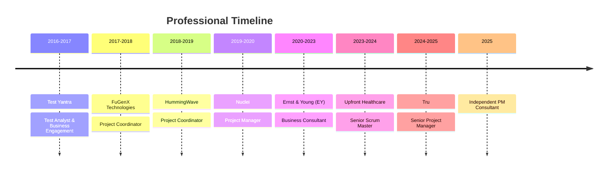

<div align="center">

# Hi there, I'm Deven Kashyap! 👋

### Senior Program Manager | Agile Transformation Leader | AI/Automation Advocate

[](https://linkedin.com/in/theyone/)
[](mailto:devisthesolution@gmail.com)
[](#)


</div>

---

## 🎯 Career Journey



## 📈 Impact at a Glance

- ✅ **Led 18-member cross-functional teams** across Banking, Healthcare, Retail
- - ✅ **Delivered 5 parallel initiatives on schedule** (web, mobile, e-commerce)
  - - ✅ **Spearheaded organization-wide Agile transformations** at Upfront Healthcare & EY
    - - ✅ **Implemented AI/ML workflow automation** (2+ years hands-on experience)
      - - ✅ **Recognized for Exceptional Quality Delivery** - BPCL Project
        - - ✅ **Managed Salesforce implementations** for enterprise clients

---

## 🚀 About Me

```yaml
name: Deven Kashyap
role: Senior Program Manager
experience: 7 years
focus:
  - Multi-domain delivery programs (Banking, Healthcare, Retail)
  - Agile transformation & coaching
  - AI/ML workflow integration
  - Governance frameworks at scale
philosophy: "Master the PM craft, adapt tech fluently, solve real problems"
```

**Driving digital transformation through Agile excellence and intelligent automation.**

Currently focused on:
- 🤖 Mastering **n8n workflow automation**
- 🧠 Exploring **Gen AI for program reporting**
- 📚 Contributing to **PM community knowledge**

---

## 💼 What I Do

<table>
<tr>
<td width="50%">

### 🎯 Program Leadership
- Lead multi-domain delivery programs
- Manage 18+ member cross-functional teams
- Coordinate parallel initiatives (web, mobile, e-commerce)
- Build sustainable velocity models
- Deliver projects on schedule with quality

</td>
<td width="50%">

### 🚀 Agile Transformation
- Coach teams through organizational change
- Design adoption strategies & governance frameworks
- Establish Agile ceremonies & best practices
- Mentor Scrum Masters & Product Owners
- Drive continuous improvement culture

</td>
</tr>
<tr>
<td width="50%">

### 🤖 AI/Automation Integration
- Integrate AI/ML workflows into PM processes
- Automate status tracking & reporting
- Implement workflow automation (n8n)
- Leverage GPT-4 for governance insights
- Build intelligent dashboards

</td>
<td width="50%">

### 📊 Governance & Frameworks
- Build scalable governance frameworks
- Establish RAID processes & dashboards
- Create program health metrics
- Design capacity planning models
- Enable data-driven decision making

</td>
</tr>
</table>

---

## 🏆 Professional Highlights

<div align="center">

| Achievement | Details |
|-------------|----------|
| 💼 **Experience** | **7 years** PM/Agile leadership across Banking, Healthcare, Retail |
| 🎓 **Certification** | **CSM® certified** (Scrum Alliance) + PMP® Training + SFPC |
| 👥 **Team Leadership** | Led **18-member** cross-functional teams |
| 🚀 **Delivery Excellence** | Delivered **5 parallel initiatives** on schedule |
| 🔄 **Transformations** | Spearheaded **organization-wide** Agile transformations |
| 🏅 **Recognition** | **Exceptional Quality Delivery** - BPCL | **EY Innovation Bronze** |

</div>

---

## 🛠️ Tech Stack & Tools

### Project Management & Collaboration


### Analytics & Visualization


### Automation & AI


### Methodologies


---

## 📊 GitHub Stats

<div align="center">


</div>

---


## 📌 Current Projects & Focus Areas

<table>
<tr>
<td>

### 🔧 Active Learning
- 🤖 n8n Workflow Automation
- 🧠 Gen AI for PM Workflows
- 🐍 Python for Data Analysis
- 📦 Docker & Containerization
- 🔒 Cybersecurity Basics

</td>
<td>

### 📚 Knowledge Sharing
- 📝 PM Templates & Playbooks
- 🎯 Agile Transformation Guides
- 🤖 Automation Scripts
- 📊 Dashboard Templates
- 💡 Best Practices Documentation

</td>
</tr>
</table>

---

## 🏆 Certifications & Training

<div align="center">

| Certification | Issuing Organization | Year |
|---------------|----------------------|------|
| 🎖️ Certified ScrumMaster® (CSM®) | Scrum Alliance | 2019 |
| 🎓 PMP® Certification Training | Simplilearn | 2019 |
| 📜 Scrum Foundations Professional (SFPC) | CertiProf | 2020 |

</div>

---

## 💬 Let's Connect!

<div align="center">

I'm always open to discussing:
- 💡 Program management best practices
- 🚀 Agile transformation strategies
- 🤖 AI/Automation in PM workflows
- 🤝 Collaboration opportunities
- 💼 Career opportunities

### Find me on:

[](https://linkedin.com/in/theyone/)
[](mailto:devisthesolution@gmail.com)
[](https://github.com/devenkashyap)

**📍 Location:** Mohali, Punjab, India  
**🕒 Timezone:** IST (UTC+5:30)  
**💬 Languages:** English, Hindi, Punjabi, Kannada

</div>

---

<div align="center">

### 💡 Philosophy

*"Master the PM craft, adapt tech fluently, solve real problems."*

---

**🌟 Open to:** Senior PM Roles | Agile Coaching | Program Management | Transformation Leadership


</div>
