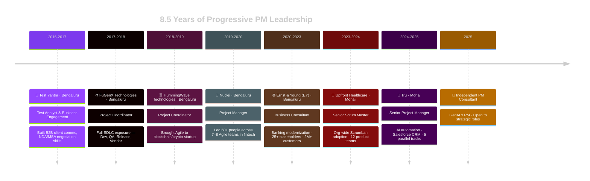

<!-- ============================================================
     DEVEN KASHYAP — GitHub Profile README
     
     HOW TO DEPLOY:
     1. Create a public repo named EXACTLY: devenkashyap
        (must match your GitHub username exactly)
     2. Place ALL of these files in the ROOT of that repo:
        - README.md     ← this file
        - header.svg    ← glassmorphism hero banner
        - metrics.svg   ← animated impact cards
        - skills.svg    ← animated skill chips
        - certs.svg     ← certification banner
     3. Push to main branch → your profile page renders live!
     ============================================================ -->

<!-- ═══════════════════════════════════════════════════════════ -->
<!--                    GLASSMORPHISM HERO                       -->
<!-- ═══════════════════════════════════════════════════════════ -->

<div align="center">



</div>

<!-- ═══════════════════════════════════════════════════════════ -->
<!--                    QUICK CONNECT                           -->
<!-- ═══════════════════════════════════════════════════════════ -->

<div align="center">

[](https://linkedin.com/in/theyone/)&nbsp;
[](mailto:devisthesolution@gmail.com)&nbsp;
[](https://github.com/devenkashyap)&nbsp;
[](https://github.com/devenkashyap)

[](https://git.io/typing-svg)

</div>

<br/>

<!-- ═══════════════════════════════════════════════════════════ -->
<!--                    IMPACT METRICS                          -->
<!-- ═══════════════════════════════════════════════════════════ -->

<div align="center">


</div>

<!-- ═══════════════════════════════════════════════════════════ -->
<!--                    ABOUT ME                                -->
<!-- ═══════════════════════════════════════════════════════════ -->

## 🧬 Identity

```yaml
name        : Deven Kashyap
title       : Senior Project Manager  |  Senior Scrum Master
experience  : 8.5+ years
location    : Mohali, Punjab, India  (IST — UTC+5:30)
languages   : [English, Hindi, Punjabi, Kannada]

domains     : [Banking, Healthcare, SaaS, Retail, Blockchain/Fintech]

superpower  : >
  I walk into organizational chaos — misaligned teams, manual status hell,
  broken governance, no delivery predictability — and I design systems
  that make it work. Repeatably. Sustainably. Without depending on me.

building_now:
  - n8n workflow automations for sprint reporting & Jira intelligence
  - GenAI-powered PMO governance dashboards (GPT-4 + Power BI)
  - Prompt engineering pipelines for delivery decision support

open_to:
  - Senior PM / Program Director roles
  - Agile Coaching & Transformation Leadership
  - AI-augmented Delivery Consulting
  - Roles with real ownership and realistic scope

philosophy  : "Master the PM craft. Adapt tech fluently. Solve real problems."
```

<!-- ═══════════════════════════════════════════════════════════ -->
<!--                    CAREER TIMELINE                         -->
<!-- ═══════════════════════════════════════════════════════════ -->

## 🚀 Career Timeline



<!-- ═══════════════════════════════════════════════════════════ -->
<!--                    EXPERIENCE                              -->
<!-- ═══════════════════════════════════════════════════════════ -->

## 💼 Professional Experience

<details>
<summary><b>🚀 Tru — Senior Project Manager &nbsp;|&nbsp; 2024–2025 · Mohali</b></summary>

<br/>

> **The Problem I Found:** Teams burning 3+ hours daily on manual status pings — killing sprint execution and delivery focus.

| What I Diagnosed & Built | Measurable Outcome |
|---|---|
| Built **n8n workflow** auto-generating daily Jira sprint summaries | **15+ team members** freed from manual update cycles |
| Created **Power BI dashboards** with real-time sprint & blocker views | Leadership achieved zero-request **self-serve** status visibility |
| Managed **18-member cross-functional team** (Dev, QA, UX, Marketing) for Salesforce B2B CRM | **On-time delivery** + high user adoption |
| Coordinated **5 parallel delivery tracks** (web, mobile, e-commerce) | **3 major products** shipped on schedule |

</details>

<details>
<summary><b>🏥 Upfront Healthcare — Senior Scrum Master &nbsp;|&nbsp; 2023–2024 · Mohali</b></summary>

<br/>

> **The Problem I Found:** Fragmented teams, unpredictable delivery, no shared governance model across 12 product teams.

| What I Diagnosed & Built | Measurable Outcome |
|---|---|
| Diagnosed team dysfunction → Designed & implemented **Scrumban** adoption | Teams hit **delivery predictability within 3 sprints** |
| Root-cause analysis on escalation delays | Resolution time cut from **10 days → 3 days** (70% improvement) |
| Authored **Azure DevOps standardization playbook** | Scrumban practices documented and scaled org-wide |
| Mentored **3 new Scrum Masters** | Built sustainable coaching capability independent of my involvement |
| Established cross-team sync + portfolio health reviews + exec forums | Governance model: team autonomy balanced with org oversight |

</details>

<details>
<summary><b>🌐 Ernst & Young (EY) — Business Consultant &nbsp;|&nbsp; 2020–2023 · Bengaluru</b></summary>

<br/>

> **The Problem I Found:** Large-scale banking transformation with no coordinated governance, unclear accountability, and fragmented stakeholder alignment.

| What I Diagnosed & Built | Measurable Outcome |
|---|---|
| Led transformation across **6 workstreams, 25+ stakeholders** | **2M+ customers** impacted; program delivered on schedule |
| Established **steering committee cadence** (weekly tactical / monthly strategic) | RACI, escalation paths, decision protocols embedded org-wide |
| Designed full **PMO operating model** (intake, stage-gate, health checks, PIR) | Organization reached measurable **project delivery maturity** |
| Built **Power BI dashboards + KPI tracking** | Leadership decision-making with zero manual status requests |
| Coached teams on **hybrid delivery** (structured governance + Agile) | Improved sprint predictability in a banking PMO environment |

</details>

<details>
<summary><b>🏦 Nuclei — Project Manager &nbsp;|&nbsp; 2019–2020 · Bengaluru</b></summary>

<br/>

> **The Problem I Found:** 7 teams (60+ people) in a high-velocity fintech startup with no shared delivery rhythm, no dependency tracking, and constant blocking.

- Designed and implemented **Scrumban governance** from zero — sprint planning, standups, retrospectives, WIP limits, flow metrics
- Built **weekly dependency tracking + cross-team comms** to reduce blocking issues significantly
- Managed **3rd-party vendor ecosystem**: SLA compliance, integration timelines, negotiation
- Orchestrated parallel **mobile and web product launches** while maintaining quality under aggressive deadlines

</details>

<details>
<summary><b>⛓️ HummingWave Technologies — Project Coordinator &nbsp;|&nbsp; 2018–2019 · Bengaluru</b></summary>

<br/>

- Introduced **Agile practices** to blockchain/crypto startup; established sprint planning and backlog grooming
- Managed **crypto wallet client relationships**: tracked requirements, ensured on-time delivery
- Built domain expertise in blockchain technology, crypto workflows, and fintech landscape

</details>

<details>
<summary><b>⚙️ FuGenX Technologies — Project Coordinator &nbsp;|&nbsp; 2017–2018 · Bengaluru</b></summary>

<br/>

- Mastered **end-to-end SDLC**: development cycles, QA, release management, vendor coordination
- Delivered under pressure: managed client/vendor-side delays; built resilience and pragmatic problem-solving

</details>

<details>
<summary><b>🔬 Test Yantra — Test Analyst & Business Engagement &nbsp;|&nbsp; 2016–2017 · Bengaluru</b></summary>

<br/>

- Built **B2B client communication skills** with global clients; overcame cultural barriers and confidence gaps
- Developed **sales and negotiation acumen**: NDA/MSA negotiation, client psychology, difficult conversations

</details>

<!-- ═══════════════════════════════════════════════════════════ -->
<!--                    SKILLS SVG                              -->
<!-- ═══════════════════════════════════════════════════════════ -->

## 🛠️ Stack & Capabilities

<div align="center">


</div>

<!-- ═══════════════════════════════════════════════════════════ -->
<!--                    CAPABILITIES MAP                        -->
<!-- ═══════════════════════════════════════════════════════════ -->

## 🧠 Capability Map

```
╔══════════════════════════════════════════════════════════════════════╗
║              DEVEN KASHYAP  ·  CAPABILITY ARCHITECTURE              ║
╠══════════════════════════╦═══════════════════════════════════════════╣
║  🔍  DIAGNOSE            ║  Root-cause analysis, AS-IS/TO-BE mapping ║
║                          ║  Org dysfunction identification            ║
║                          ║  Stakeholder analysis & readiness assess.  ║
╠══════════════════════════╬═══════════════════════════════════════════╣
║  🎯  DESIGN              ║  PMO operating models & governance         ║
║                          ║  Escalation paths, RACI, decision forums   ║
║                          ║  Phase-gate methodology across lifecycle    ║
╠══════════════════════════╬═══════════════════════════════════════════╣
║  🚀  DELIVER             ║  Multi-team coordination (60+ people)      ║
║                          ║  5 parallel initiative management           ║
║                          ║  Vendor ecosystem & SLA management          ║
╠══════════════════════════╬═══════════════════════════════════════════╣
║  🔄  TRANSFORM           ║  Agile coaching & Scrumban adoption         ║
║                          ║  Org-wide change management & comms         ║
║                          ║  Resistance navigation, capability building  ║
╠══════════════════════════╬═══════════════════════════════════════════╣
║  🤖  AUTOMATE            ║  n8n workflow design & GPT-4 integration    ║
║                          ║  AI-powered dashboards & status automation  ║
║                          ║  Prompt engineering for PM intelligence     ║
╚══════════════════════════╩═══════════════════════════════════════════╝
```

<!-- ═══════════════════════════════════════════════════════════ -->
<!--                    CERTIFICATIONS                          -->
<!-- ═══════════════════════════════════════════════════════════ -->

## 🏆 Certifications

<div align="center">


| Status | Certification | Body |
|---|---|---|
| ✅ Active | **Certified ScrumMaster® (CSM®)** | Scrum Alliance — Jan 2019 |
| ✅ Active | **PMP® Certification Training** | Simplilearn — Feb 2019 |
| ✅ Active | **Scrum Foundations Professional (SFPC)** | CertiProf — Jun 2020 |
| ✅ Active | **Microsoft Project 2013** | Microsoft |
| ✅ Active | **Green Jujitsu Leadership** | — |
| 🔄 In Progress | **SAFe Agilist** | Scaled Agile · 2025 |
| 🔄 In Progress | **n8n AI Workflow Automation** | n8n · 2025 |
| 🔄 In Progress | **Prompt Engineering Specialization** | — · 2025 |

</div>

<!-- ═══════════════════════════════════════════════════════════ -->
<!--                    GITHUB STATS                            -->
<!-- ═══════════════════════════════════════════════════════════ -->

## 📈 GitHub Activity

<div align="center">


<br/>


</div>

<!-- ═══════════════════════════════════════════════════════════ -->
<!--                    CURRENTLY BUILDING                      -->
<!-- ═══════════════════════════════════════════════════════════ -->

## 🔧 Currently Building

<table>
<tr>
<td width="50%" valign="top">

**🤖 Active Learning**
- `n8n` Workflow Automation — Sprint intelligence pipelines
- `GenAI` for PM Workflows — Governance & delivery intelligence
- `Python` for PM Data Analysis — Metrics & dashboards
- `Prompt Engineering` — AI-augmented decision making
- `SAFe Agilist` — Enterprise Agile at scale

</td>
<td width="50%" valign="top">

**📚 Knowledge Sharing**
- 📝 PM Templates & Playbooks *(open-sourcing)*
- 🎯 Agile Transformation Guides for practitioners
- 🤖 Automation Scripts for Jira + n8n + Power BI
- 📊 Ready-to-use Dashboard Templates
- 💡 Scrumban adoption frameworks & retro kits

</td>
</tr>
</table>

<!-- ═══════════════════════════════════════════════════════════ -->
<!--                    CONNECT                                 -->
<!-- ═══════════════════════════════════════════════════════════ -->

## 🤝 Let's Connect

<div align="center">

I'm open to conversations about **Program Management** · **Agile Transformation** · **AI in PM Workflows** · **PMO Architecture** · **Collaboration & Mentoring**

<br/>

[](https://linkedin.com/in/theyone/)
[](mailto:devisthesolution@gmail.com)
[](https://github.com/devenkashyap)

<br/>

**📍 Mohali, Punjab, India** &nbsp;|&nbsp; **🕒 IST (UTC+5:30)** &nbsp;|&nbsp; **💬 English · Hindi · Punjabi · Kannada**

<br/>

**🌟 Open To:**&nbsp;


</div>

---

<div align="center">

> *"Master the PM craft. Adapt tech fluently. Solve real problems."*
>
> *Diagnose the dysfunction · Design the solution · Deliver with precision · Sustain the change*


</div>
